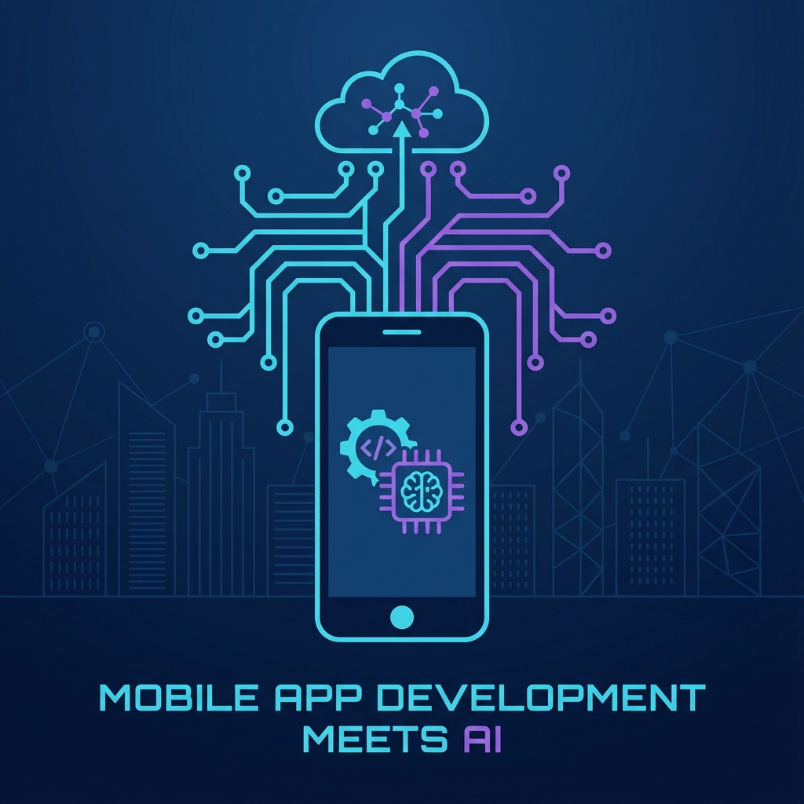

# Hi there, I'm Ahmed! 

### 👨‍💻 Flutter & Front-End Developer | ⚛️ Physics Educator

*Based in Mansoura, Dakahlia, Egypt 🇪🇬*

Welcome to my GitHub profile! I am a **Physics graduate** turned **Software Developer**, passionate about building scalable mobile solutions and innovative AI applications. I specialize in combining robust logic with creative design.

---

### 🚀 **About Me**

I have a unique background in **Theoretical Physics** which gives me a strong analytical foundation for problem-solving in software development.

- 💼 **Experience**: 
    - **Flutter Developer** (2019–Present): Developing high-performance cross-platform apps.
    - **Front-End Developer** (2024–Present): Building responsive, accessible web interfaces.
    - **Physics Educator** (2019–2023): Simplifying complex scientific concepts.
- � **Currently working on**: **Naptah** (Plant health monitoring) & Advanced Mobile Apps.
- 🌱 **Learning**: System Design, Cloud Architecture, and AI Integration.
- 🎓 **Education**: Bachelor's in **Physical Sciences**, Mansoura University (*Very Good with Honour*).
- ⚡ **Fun fact**: I love turning complex problems into simple, beautiful code.

---

### 🛠️ **Tech Stack & Specialties**

  

 

| **Mobile** | **Front-End** | **AI & Cloud** |
|:---:|:---:|:---:|
|  |  |  |
|  |  |  |
|  |  |  |
| MIT App Inventor | JavaScript (ES6+) | Prompt Engineering |

---

### 🏆 **Featured Projects**

| Project | Role & Tech | Description |
|:---:|:---|:---|
| **Naptah** | **Team Leader** `Flutter` `Firebase` `Gemini API` | 🌱 Plant health monitoring app with disease detection & comprehensive reports. (Aug 2025) |
| **Trip Tracker** | **Developer** `Angular` `Ionic` `TypeScript` | 🚕 Web-based, mobile-first ride-sharing application. |
| **Hakamty** | **Developer** `Video Analysis` `Firebase` | 🥋 AI-powered karate kata performance evaluation. |
| **CropCare** | **Developer** `AI` `Google Cloud` | 🌾 AI-powered plant disease identification and diagnosis application. |
| **Quzai** | **Developer** `EdTech` `AI` | 🤖 Educational platform creating safe conversational learning experiences for kids. |

---

### 📜 **Certifications & Training**

- **Front-End & Cross-Platform Mobile Development Track** | *Information Technology Institute (ITI)* - Intensive Training Program (July 2025 - Present)
- **Global AI Hackathon 2025** | *Participant - Certificate of Participation*
- **Digital Marketing Fundamentals** | *Google (Maharat Google)*
- **Front End Development Track** | *Udacity (One Million Arab Coders Initiative)*

---

### 📊 **GitHub Stats**

  

  
  

   

  

---

### 📫 **Connect with Me**

  
  
  
  
  

---

  <i>Thanks for visiting! Feel free to leave a ⭐ on my repositories.</i>

